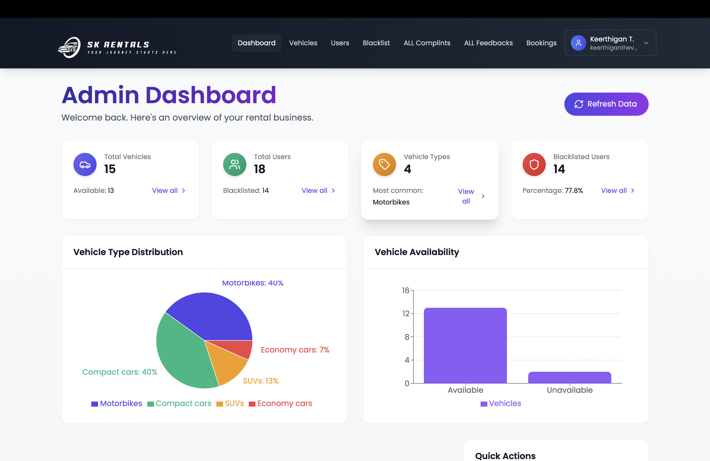
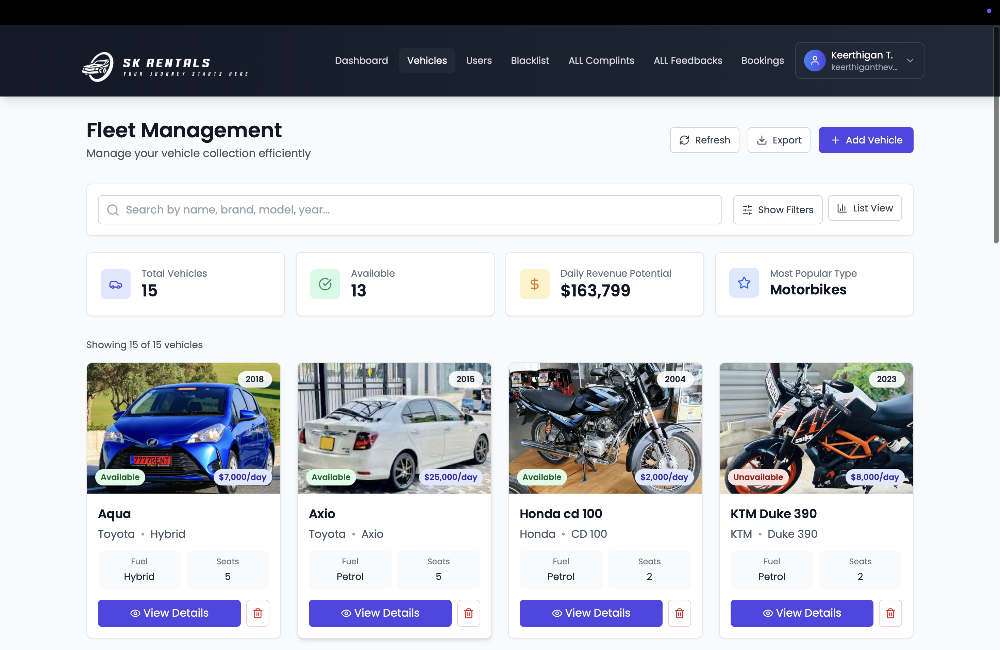
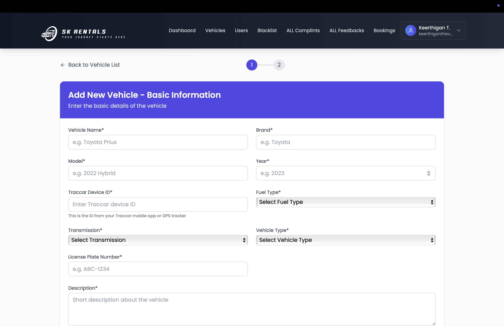
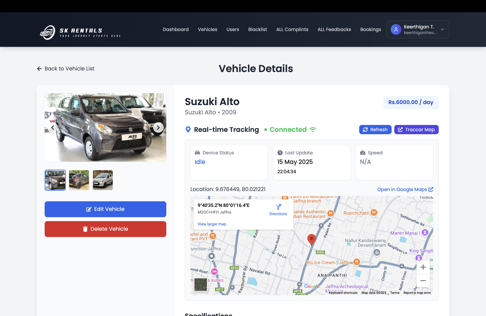
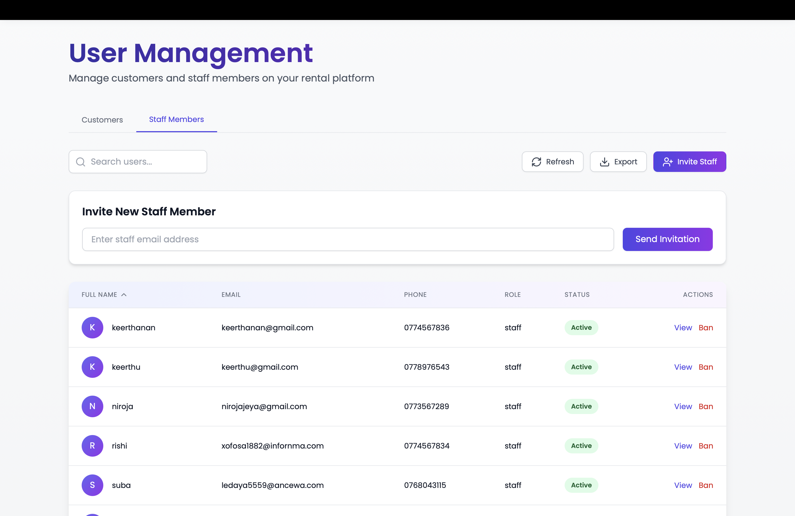
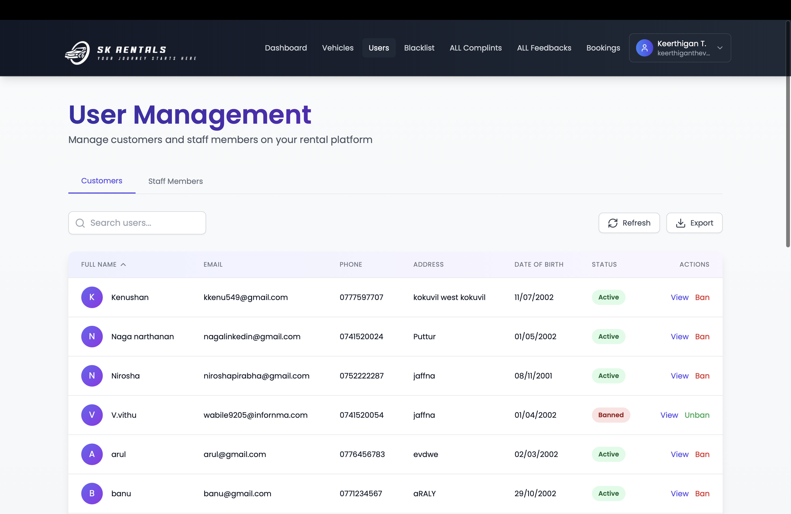
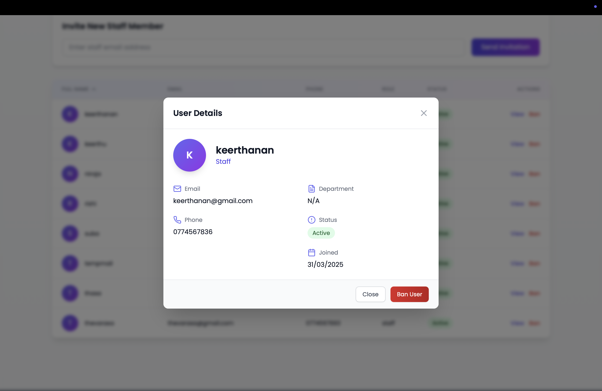
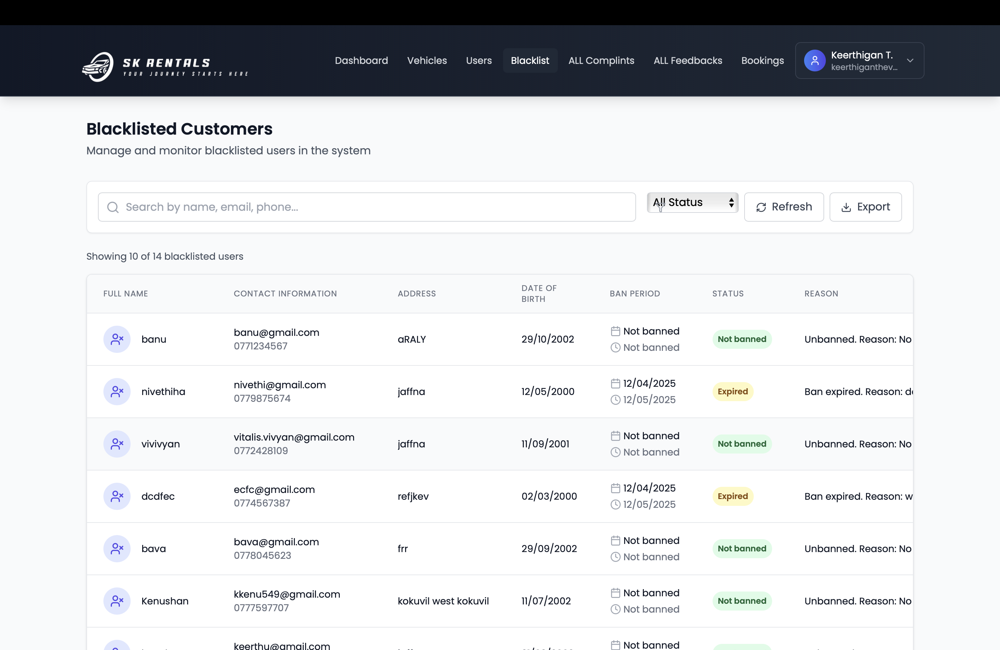

# 🚗 SK Rentals – Online Vehicle Rental Management System

SK Rentals is a full-stack vehicle rental platform developed for the 2nd Year, 2nd Semester Information Technology Project (ITP) at NorthernUni – SLIIT. It features a complete admin dashboard, user portal, booking system, real-time vehicle tracking using mobile GPS, and more.

📦 Technologies:

* Frontend: React.js, Tailwind CSS
* Backend: Node.js, Express.js, MongoDB (via Mongoose)
* Cloudinary (image upload), SweetAlert2, JWT, Google Maps

---

## 🎯 Objective

To provide a complete solution for vehicle rental companies to manage their vehicles, users, bookings, and tracking—all with real-time support and an affordable tracking system using mobile GPS.

---

## 🏗️ System Architecture

```
                            +-----------------------------+
                            |     Frontend (React.js)     |
                            |  Tailwind CSS + JS + JSX    |
                            +------------+----------------+
                                         |
                                         ▼
                              REST API (Express.js)
                                         ▼
+----------------------+        +---------------------+        +----------------------+
| Admin Panel (UI)     |<-----> | Backend Server      |<-----> | MongoDB Atlas        |
| User Panel (UI)      |        | Node.js + Express   |        | (via Mongoose ODM)   |
+----------------------+        +---------------------+        +----------------------+
                                         ▲
                                         |
                           +-----------------------------+
                           | Mobile GPS Device (Testing) |
                           |  Sends Location by Track ID |
                           +-----------------------------+
```

---

## 📁 Full Project Folder Structure

```
SK-Rentals/
├── backend/                        # Node.js + Express Backend
│   ├── controllers/               # Business logic (vehicles, users, auth, etc.)
│   ├── models/                    # Mongoose Schemas (Vehicle, User, Booking)
│   ├── routes/                    # API route handlers (/vehicles, /users, etc.)
│   ├── utils/                     # JWT, Auth Middleware, Cloudinary Config
│   ├── .env                       # Environment Variables (Not committed)
│   └── server.js                  # Entry Point for Backend
│
├── frontend/                      # Frontend Monorepo
│   ├── admin/                     # Admin Dashboard React App
│   │   ├── pages/                 # Pages (AddVehicle, ViewUsers, Blacklist, etc.)
│   │   ├── components/            # Reusable Components (Cards, Forms, etc.)
│   │   ├── utils/                 # Cloudinary, Auth Utils
│   │   ├── App.js                 # Main Admin App
│   │   └── tailwind.config.js     # Tailwind Config (Admin)
│   │
│   └── user/                      # User Website React App
│       ├── pages/                # Homepage, Booking, Contact
│       ├── components/           # VehicleCards, Filter, Feedback
│       ├── styles/               # Tailwind + Global Styles
│       ├── App.js                # Main User App
│       └── tailwind.config.js    # Tailwind Config (User)
│
├── README.md                      # Complete Project Documentation (You are Here)
└── package.json                   # Global Dependency Declaration (Optional)
```

---

## ⚙️ Setup Guide – Run Everything Together

### 1️⃣ Clone the Repository

```bash
git clone https://github.com/Keerthithev/Y2S2_SK-Rentals-Online-vehicle-rental-.git
cd Y2S2_SK-Rentals-Online-vehicle-rental-
```

### 2️⃣ Backend Setup

```bash
cd backend
npm install
```

Create a `.env` file:

```
PORT=1111
MONGO_URI=your_mongo_uri
JWT_SECRET=your_secret_key
CLOUDINARY_CLOUD_NAME=your_cloud_name
CLOUDINARY_API_KEY=your_cloud_key
CLOUDINARY_API_SECRET=your_cloud_secret
```

Then start the backend:

```bash
npm run dev
```

Backend will run on: [http://localhost:1111](http://localhost:1111) (default configured port)

### 3️⃣ Frontend – Admin Dashboard

```bash
cd frontend/admin
npm install
npm start
```

Runs on [http://localhost:2222](http://localhost:2222)

### 4️⃣ Frontend – User Website

```bash
cd frontend/user
npm install
npm start
```

Runs on [http://localhost:3001](http://localhost:3001) (or auto-selected port)

---

## 🌐 Features

### 🔧 Admin Dashboard (By me)

* Add / View / Delete / Edit Vehicles
* Assign Cloudinary images to each vehicle
* Assign Location Tracking ID to enable GPS tracking
* Live Google Map embedded for assigned vehicles
* Ban/Unban users & staff
* Invite staff accounts via email
* View/manage blacklist page

### 📍 Real-Time GPS Tracking (by me)

* Each vehicle has a Track ID
* Only one vehicle currently assigned to Keerthigan's mobile GPS for demo
* Other vehicles show “Track ID Not Assigned”
* Map updates dynamically in admin single vehiclelist for assigned vehicle

### 🧑‍💼 Staff/Customer Management (by me)

* List all users and staff
* Ban/unban functionality
* Blacklist view for banned users

### 📆 Booking System (By Member 3)

* Book any available vehicle
* Select pickup and drop date
* Admin view of all bookings

### ⭐ Feedback & Ratings (By Member 2)

* Users rate rented vehicles
* View reviews in admin panel

### 🛠️ Maintenance Logs (By Member 4)

* Add maintenance entry for any vehicle
* Set service type, cost, notes
* Mark vehicle as “Under Maintenance”

### 🏠 User Pages (By Member 5)

* Homepage, Contact, About, profile
* User login/register
* View all vehicles and book

---

## 👤 Team Members & Roles

| Member     | Responsibilities                                                                           |
| ---------- | ------------------------------------------------------------------------------------------ |
| Keerthigan | Admin Dashboard, GPS Tracking, Fleet Management, User/Staff Management, Blacklist Features |
| Member 2   | Ratings and Feedback System                                                                |
| Member 3   | Booking System                                                                             |
| Member 4   | Maintenance Management                                                                     |
| Member 5   | User Profile, Pages, Authentication, Home & Contact Pages                                           |

---

## 📸 Screenshots (My contribution )

* Admin Dashboard


* Fleet management


* Add Vehicle Form


* Live Tracking Map

   
* Manage staffs


* Manage customers


* User details


* Blacklist


---

## 📜 License

This system was developed for academic purposes for the Information Technology Project module at SLIIT (NorthernUni). All rights reserved by the respective team members.

© 2025 SK Rentals Team
